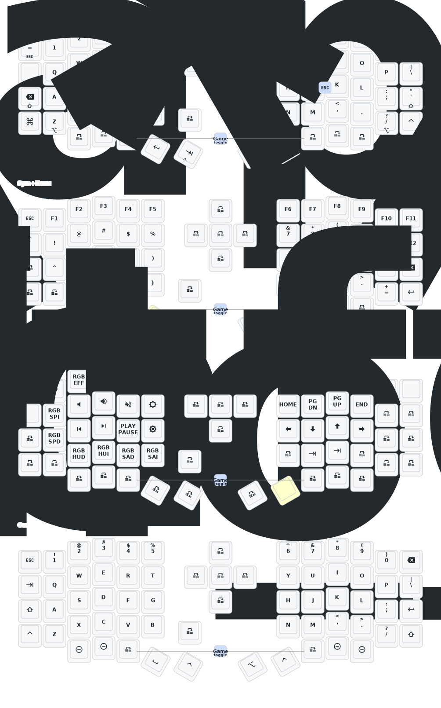

# Sofle 分体人体工学键盘 ZMK 固件配置

这是我的 [Sofle](https://github.com/josefadamcik/SofleKeyboard) 分体式人体工学键盘的个人 ZMK 固件配置。

此配置针对带有 nice!view 屏幕的键盘进行了优化。

## ✨ 主要功能

- **nice!view 屏幕支持**: 显示层信息、连接状态等。
- **省电模式**: 长时间不活动后自动进入睡眠模式。

## 硬件

- Sofle 分体键盘
- nice!nano 控制器
- nice!view 屏幕

## ⌨️ 按键映射 (Keymap)

键盘布局分为多个图层，以便快速访问所有需要的键。

### 第 0 层: 主要 (Main)

这是默认的基础图层，包含标准的字母和修饰键。

- **长按/短按**:
    - `ESC` / `=`
    - `Shift` / `Backspace`
    - `Alt` / `Z`
    - `Ctrl` / `Tab`
- **图层切换**:
    - `ENTER` (长按切换到第 1 层)
    - `SPACE` (长按切换到第 2 层)

### 第 1 层: 符号与数字 (Sym+Num)

此图层包含数字、F键和常用符号。

### 第 2 层: 系统与媒体控制 (Brd+Sys)

此图层用于控制系统功能、媒体播放和 RGB 灯效。

- **蓝牙控制**: `BT_PRV`, `BT_NXT`, `BT_CLR`
- **RGB 控制**: `RGB_TOG`, `RGB_EFF`, `RGB_BRI`, `RGB_BRD`
- **媒体键**: `C_VOLUME_DOWN`, `C_VOLUME_UP`, `K_MUTE`, `K_PLAY_PAUSE`
- **系统**: `sys_reset`

## 🛠️ 构建与刷写 (Build & Flash)

您需要安装 `west` 工具来构建固件。

1.  **设置 ZMK 环境**:
    请参考 [ZMK 官方文档](https://zmk.dev/docs/user-setup) 进行环境配置。

2.  **构建固件**:
    在项目根目录运行以下命令来构建左手和右手的固件：
    ```bash
    west build -d build/left -b eyelash_sofle_left -- -DSHIELD=eyelash_sofle_left
    west build -d build/right -b eyelash_sofle_right -- -DSHIELD=eyelash_sofle_right
    ```

3.  **刷写固件**:
    将控制器置于引导加载程序模式，然后将生成的 `.uf2` 文件（位于 `build/left` 和 `build/right` 目录中）复制到控制器上。

## 🗺️ 键盘布局图 (Keymap Drawer)

本项目包含一个 `keymap-drawer` 配置，可以生成键盘布局的 SVG 图像。

要生成布局图，请运行：
```bash
keymap-drawer -c keymap_drawer.config.yaml
```
生成的 `eyelash_sofle.svg` 文件将位于 `keymap-drawer/` 目录下。

当 `eyelash_sofle.svg` 文件更新并提交到版本库后，下方显示的键盘布局图也会自动更新。


